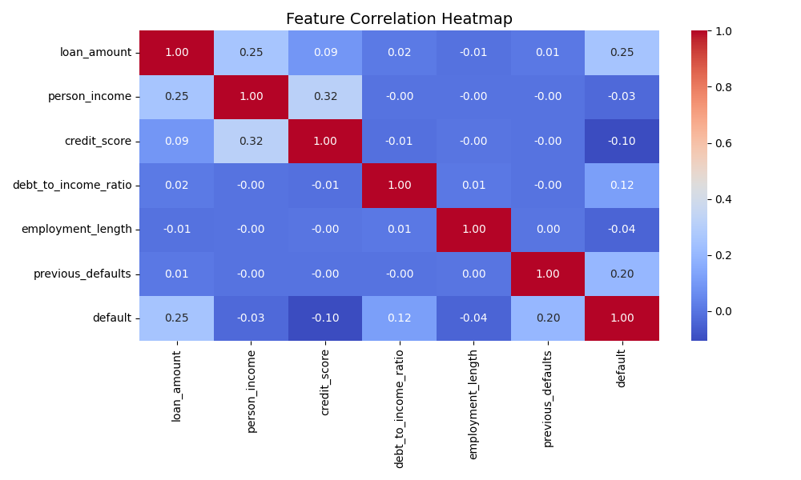

# 💸 Default Risk Prediction ML Model — Built for Real-World Lending Decisions

> **Predict loan defaults with speed, accuracy, and full transparency — right from your browser.**

This repo is your **credit risk prediction powerhouse**.  
Upload a dataset, hit run in Google Colab, and **watch it return default probabilities, confidence scores, and explainable risk factors** — in seconds.  
No clunky local installs, no opaque AI. Just **clear, actionable predictions**.

---

## 🚀 Why This Isn’t Just “Another ML Model”

- ⚡ **Run anywhere** — Fully Colab-compatible, no setup pain
- 🧠 **Cerebra Neural Core** — Lightweight, optimized for *tabular financial data*
- 🔍 **Explainability built-in** — See *why* the model says “High Risk” or “Safe”
- 📊 **Visual EDA** — Understand your data before trusting the predictions
- 🔄 **Multiple models inside** — Cerebra + Random Forest baseline, with easy swaps

---

## 📂 What’s Inside

- `loan_default_21k.csv` — Raw dataset (in repo already)
- **Google Colab Notebook** — Data Prep → EDA → Model Training → Interactive CLI
- CLI logging system that saves every prediction in `predictions_log.csv`
- EDA visuals (default rate plots, feature correlations)
- Model artifacts (auto-saved in Colab session after training)

---

## ⚡ Try It Now in Google Colab

1️⃣ **Open notebook** → 2️⃣ **Upload `loan_default_21k.csv`** → 3️⃣ **Run all cells** → 4️⃣ **Predict & get explanations**.  

---

## 🧪 How It Works (Simple Version)

1. **Data Prep & EDA**
   - Cleans data (missing values, outliers, transformations)
   - Generates visuals:  
       
       

2. **Model Training**
   - Splits data into train/test
   - Trains **Cerebra neural net** + **Random Forest**
   - Calibrates probabilities for trustworthy risk scores
   - Saves models as `.pkl` and `.pth` files in session

3. **Interactive CLI**
   - Enter: `loan_amount, person_income, credit_score, debt_to_income_ratio, employment_length, previous_defaults`
   - Get:
     - **Probability of default**
     - **Confidence bar**
     - **Top 3 factors influencing decision**
     - **Risk category (Low/Medium/High)**
     - **Safety flags** (e.g., "Manual review recommended")

---

## 🎯 Example CLI Output

Prediction: HIGH RISK 🚨
Default Probability: 0.83
Confidence: ██████████░░░░░░ 83%
Top Factors:

Low credit score

High debt-to-income ratio

Multiple previous defaults
Action: Manual review strongly advised.

---

## 🌎 Where You Can Use This

- Bank loan application screening
- Microfinance credit scoring
- Online lending pre-approval checks
- Fraud detection via anomaly spotting

---

## 🤝 Contributing

Got a feature idea?  
Fork → Build → PR.  
We’ll credit you in the **Contributors Hall of Fame**.

---

## 📜 License

MIT - Because we dont believe in chains :)

---

### TL;DR
**This is your all-in-one, no-install, explainable default risk prediction system.**  
Open in Colab → Upload CSV → Run → Get trustworthy risk scores & reasons.  
💥 *Done.*
